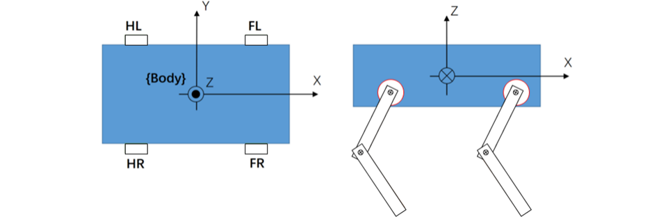
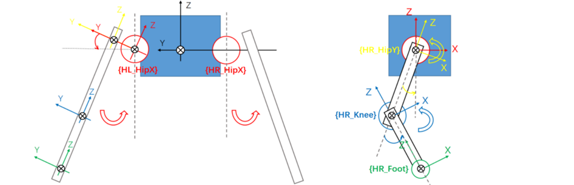
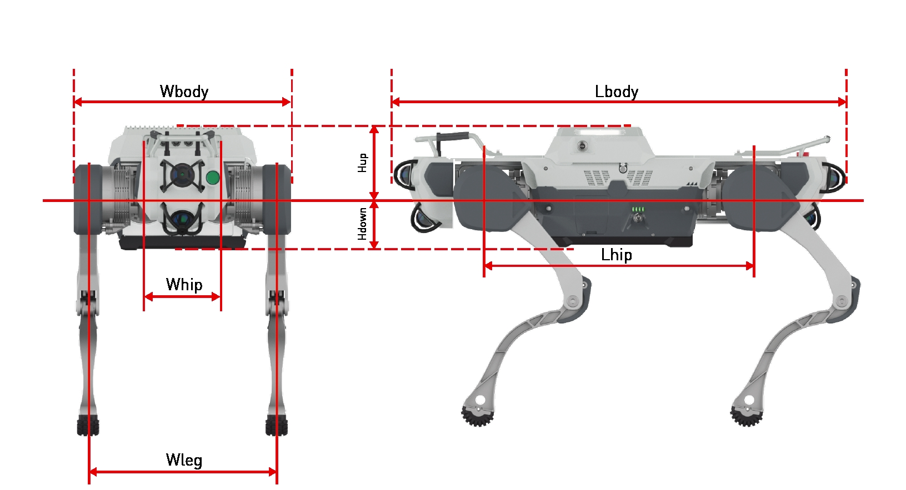
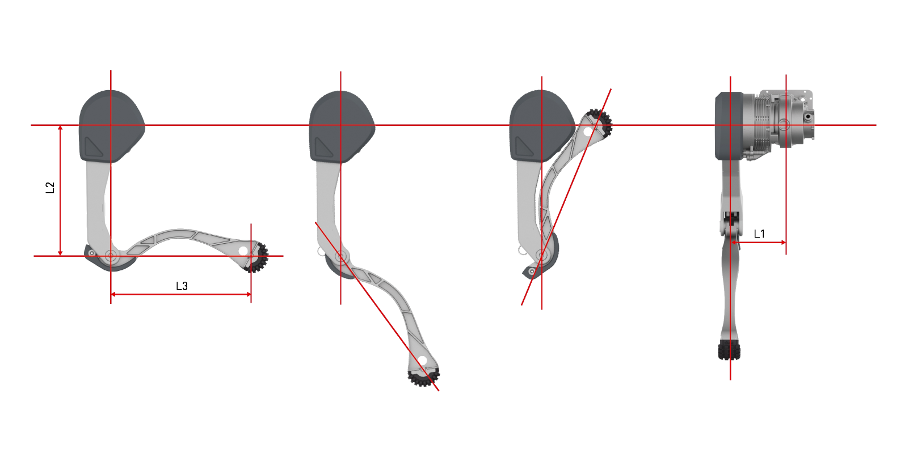
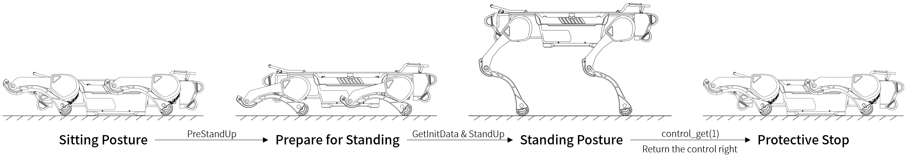

# Jueying X30 Motion SDK

[简体中文](./README_ZH.md)

&nbsp;
## 1 SDK Change Log

### V1.0 (2024-01-20)
First release.

### V2.0 (2024-03-29)
Add python version.

&nbsp;
## 2 SDK Introduction
**MotionSDK** is used for motion control algorithms development, supports C++ and Python. It provides five control parameters to control the motion of joints: $pos_{goal}$, $vel_{goal}$, $kp$, $kd$, $t_{ff}$.

When SDK sends joint commands to the robot, the underlying controller will run the joint commands from SDK with priority and distribute the commands to the 12 joints of the robot. The final control signal for the joints can be calculated based on the five control parameters:
$$T=kp*(pos_{goal} - pos_{real})+kd*(vel_{goal} - vel_{real})+t_{ff}$$

The driver will convert final joint control signal into a desired current and perform closed-loop control at a frequency of 20kHz.

When the underlying controller has not received the commands from SDK for more than 1 second, it will retrieve control right, enter a damping protection mode, and after a certain period, clear the joint commands.

**Example of control parameters for various control methods:**

Position Control:
$$pos_{goal}=3.14, vel_{goal}=0, kp=30, kd=0, t_{ff} = 0$$
Velocity Control:
$$pos_{goal}=0, vel_{goal}=5, kp=0, kd=1, t_{ff} = 0$$
Damping Control:
$$pos_{goal}=0, vel_{goal}=0, kp=0, kd=1, t_{ff} = 0$$
Torque Control:
$$pos_{goal}=0, vel_{goal}=0, kp=0, kd=0, t_{ff} = 3$$
Zero Torque Control:
$$pos_{goal}=0, vel_{goal}=0, kp=0, kd=0, t_{ff} = 0$$
Hybrid Control:
$$pos_{goal}=3.14, vel_{goal}=0, kp=30, kd=1, t_{ff} = 1$$

&nbsp;
## 3 Parameters

### 3.1 Body and Joint Coordinate System





> Caution: The arc-shaped arrow indicates the positive direction of rotation for the joint coordinate system with the same color.

### 3.2 Link Lengths of Body



| Parameter | Value     | Description                 |
| ----------| -------- | -------------------- |
| Lbody| 0.98m  | length of body           |
| Lhip | 0.582m | distance between the centers of front hip and hind hip   |
| Whip | 0.16m  | distance between the centers of left hip and right hip |
| Wleg | 0.3935m| distance between the centers of left leg and right leg     |
| Wbody| 0.454m | width of body|

### 3.3 Link Lengths of Leg



| Parameter              | Value     | Description                       |
| ---------------------- | -------- | ------------------------------ |
| L1 | 0.1167m | distance between the centers of leg and HipX |
| L2 | 0.3m     | length of upper leg       |
| L3 | 0.31m    | length of lower leg       |
| Rfoot | 0.039m    | foot radius           |

### 3.4 Joint Parameters

| **Joint**     | **Range** | **Nominal Torque** | **Nominal Velocity** | **Max Torque** |
| ------------ | ------------ | ------------ | ------------ | ------------ |
| HipX  | -18.5°~33.5° | 28N·m         | 12rad/s      | 84N·m         |
| HipY  | -170°~15°    | 28N·m         | 12rad/s      | 84N·m         |
| Knee  | 24°~140°     | 65N·m         | 11rad/s      | 180N·m        |

> Caution: Additional dynamics parameters for Jueying X30 are available in the URDF file provided.

&nbsp;
## 4 SDK Download

Clone **x30_motion_sdk** repository to local host:
```bash
cd xxxxxxxxxx    #cd <to where you want to store this project>
git clone --recurse-submodules https://github.com/DeepRoboticsLab/x30_motion_sdk.git
```

&nbsp; 
## 5 Configure the Motion Host

The developer can remotely connect to the motion host via ssh to configure the destination IP address for the motion host to send motion data such as joint data, and SDK-related parameters.

The default port number for SDK to receive data reported by the motion host is 43897. The port number for the C++ project can be modified in ***/include/parse_cmd.h*** , and for the Python project, it can be modified in ***/python/motion_sdk_example.py*** .

- Connect the development host to the robot's WiFi.

- Open the ssh connection software on the development host and enter`ssh ysc@192.168.1.103`, with the password `'` [a single quote], to connect to the motion host remotely.
- Enter the following command to open the network config file:
	```Bash
	cd ~/jy_exe/conf/
	vim network.toml
	```
- In the config file ***network.toml*** , `ip` and `target_port` form a pair consisting of an IP address and a port number. The addresses in the `ips` correspond to the port numbers in `ports` in sequential order. The specific contents of the file are as follows:
	```toml
	ip = '192.168.1.103'
	target_port = 43897
	local_port = 43893
	ips = ["192.168.1.105","192.168.1.106","192.168.1.xxx"]
	ports = [43897,43897,43897]
	```
	
- When running, motion host will send joint data to the addresses contained in the `ip` and `ips` of the configuration file, along with their corresponding port numbers.

	- If **MotionSDK** is running within the motion host, please ensure that `ip` or `ips` already includes the motion host IP `192.168.1.103`, along with the corresponding port number matching the port number where the program is receiving data.

	- If **MotionSDK** is running on the developer's own development host, please add the static IP of the development host to `ips` as `192.168.1.xxx`, and add the port number of the program receiving data at the corresponding position in `ports`.

- After the data reporting address is configured, you need to turn on the switch for the motion host to report data to the sdk, first open the config file ***sdk_config.toml***:
	```Bash
	cd ~/jy_exe/conf/
	vim sdk_config.toml
	```

- Modify the value of `enable_joint_data` in the config file ***sdk_config.toml*** (If this file does not exist, please create it):
	```toml
	enable_joint_data = true
	```
- In the same config file  ***sdk_config.toml***, the joint torque limits can be modified as required:
	```toml
	torque_limit=[42.0,42.0,90.0]
	```
	The array elements are defined as follows:

	| Array Element | Meaning     | Range  |Type|
	| --- | -------- | ---------- | ---------- |
	| torque_limit[0] | hipx torque limit(N·m)| (0,84.0] | double |
	| torque_limit[1] | hipy torque limit(N·m)| (0,84.0] | double |
	| torque_limit[2] | knee torque limit(N·m)| (0,160.0] | double |

	>Caution: When initially testing a new motion program, it is advisable to set the torque limiting to a lower level. Once the program has been verified without errors, the torque limiting can be gradually increased to ensure the robot remains in a safe state.

- Restart the motion program to apply the new configuration:
	```bash
	cd ~/jy_exe
	sudo ./stop.sh
	sudo ./restart.sh
	```

&nbsp;
## 6 Compile and Run

The example codes ***/example/main.cpp*** (C++ version) and ***/python/motion_example.py*** (Python version) provide a simple demo of standing up, and after standing for a while, it returns control right to the underlying controller, and the robot automatically enters damping protection mode.



**But to ensure the safe use of the SDK, in the original code of the two demos, the code for sending joint control commands is commented out:**   

C++ ( */example/main.cpp* ):
```c++
// if(is_message_updated_){
//   send2robot_cmd->set_send(robot_joint_cmd);  
// }               
```
Python ( */python/motion_sdk_example.py* ):
```python
# sender.set_send(robot_joint_cmd)
```
**Caution: Before uncommenting, the developer must make sure that the communication between SDK and the robot is functioning properly (refer to "6.1 Check the Communication"), and make sure that the joint control commands sent by SDK are correct, to avoid posing a risk when executing the control commands!**

**Caution: When using Jueying X30 to test your motion control algorithms or do experiments, all present personnel should keep at least 5 meters away from the robot and the robot should be hung on the robot hoisting device, to avoid accidental damage to personnel and equipment. If the user needs to approach the robot during experiment, the user must ensure that either the robot is put into an emergency stop state or the motion program is shut down using the `sudo ./stop.sh`.**

### 6.1 Check the Communication

MotionSDK uses UDP to communicate with the robot.

To check if the robot has successfully sent data to the SDK, developers can print data such as joint data or imu data using the SDK to determine whether the SDK received the data sent by the robot, or observe whether "No data from the robot was received!!!!!!" is printed when running the demo.

Refer to 6.3 to compile and run the original example codes and observe whether it is normal to print the data sent by the robot in the terminal.

### 6.2 Communication Troubleshooting

If SDK does not receive the data sent by the robot, you can follow the steps below to troubleshoot:

- First check if the development host is under the same network segment as the robot host (this step can be skipped if you are running the SDK on the robot motion host):

  - Connect the development host to the robot WiFi or Ethernet port, and then ping the motion host on the development host.

  - If the ping shows the response, use SSH to connect to the robot motion host, and ping the static IP address of the development host from the motion host.

  - If there is no reply, try to manually set the IP address of your development host and follow Chapter 5 again to configure the motion host.

- If the development host is a virtual machine, it is recommended to configure bridged networking for your virtual machine, manually reset its IP address and reboot it. Then follow Chapter 5 again to configure the motion host.

If SDK still can't receive the data sent by the robot, you can capture the packet on the motion host:

- If **MotionSDK** is running on the robot motion host, run `sudo tcpdump -x port 43897 -i lo`;

- If **MotionSDK** is running on development host, run `sudo tcpdump -x port 43897 -i eth1`.

Wait for 2 minutes after entering the packet capture command,and observe whether the robot has sent raw data to SDK. If not, enter the top command to see if the process *jy_exe* (robot motion program)is running normally. If *jy_exe* is not running normally, refer to the following command to restart the motion program:
```bash
 cd ~/jy_exe
 sudo ./stop.sh
 sudo ./restart.sh
```
### 6.3 Compile and Develop

After ensuring that the SDK communicates properly with the robot and confirming that your control commands are correct, you can uncomment the code for sending commands to the robot in the original code, then recompile and run it.

#### 6.3.1 C++
Open a new terminal and create an empty ***build*** directory (Or empty all contents in the ***build*** directory if it has already been created):
```bash
cd xxxxxxxx     # cd <path to where you want to create build directory>
mkdir build
```

Navigate to the ***build*** directory and then compile:
```bash
cd build
cmake .. -DBUILD_EXAMPLE=ON
make -j
```

After compilation, an executable file named ***motion_sdk_example*** is generated in the ***/build/example*** directory. Enter the following codes in terminal to run the program:
```bash
./example/motion_sdk_example
```

#### 6.3.2 Python
SDK for Python programmers uses Pybind to create Python bindings for C++ libraries. 
If you have compiled the C++ example codes, you can directly navigate to the existing ***build*** directory. If you have never compiled the example codes, please create a new ***build*** directory first:
```bash
cd xxxxxxxx     # cd <path to where you want to create build directory>
mkdir build
```

Navigate to the ***build*** directory and then compile:
```bash
cd build
cmake .. -DBUILD_PYTHON=ON
make -j
```

Normally, the compiled dynamic library files will be automatically copied to the ***/python/lib*** directory. Then you can navigate to the ***/x30_motion_sdk/python*** directory and directly execute ***motion_sdk_example.py***:
```bash
cd /python
python motion_sdk_example.py
```

&nbsp;
##  7 Example Code (C++)

This chapter explains ***/example/main.cpp*** . 

Timer, used to set the algorithm period and obtain the current time:

```cpp
TimeTool my_set_timer;
my_set_timer.time_init(int);                              		  ///< Timer initialization, input: cycle; unit: ms
my_set_timer.get_start_time();                           		  ///< Obtain time for algorithm
my_set_timer.time_interrupt()			      		              ///< Timer interrupt flag
my_set_timer.get_now_time(double);               		          ///< Get the current time
```

After binding the IP and port of the robot, SDK will acquire control right and can send the joint control commands:

```cpp
SendToRobot* send2robot_cmd = new SendToRobot("192.168.1.103",43893);   ///< Create a sender thread
send2robot_cmd->robot_state_init();                           		    ///< Reset all joints to zero and gain control right
send2robot_cmd->set_send(RobotCmdSDK); 			     		            ///< Send joint control command
send2robot_cmd->control_get(int);                            		    ///< Return the control right
```

SDK receives the joint data from the robot:

```cpp
ParseCommand* robot_data_rec = new ParseCommand;           		  ///< Create a thread for receiving and parsing
robot_data_rec->getRecvState(); 			      		          ///< Receive data from 12 joints
```

The data SDK received will be saved into `robot_data`:

```cpp
RobotDataSDK *robot_data = &robot_data_rec->getRecvState(); 		  ///< Saving joint data to the robot_data
///< Left front leg：fl_leg[3], the sequence is fl_hipx, fl_Hipy, fl_knee
///< Right front leg：fr_leg[3], the sequence is fr_hipx, fr_Hipy, fr_knee
///< Left hind leg：hl_leg[3], the sequence is hl_hipx, hl_Hipy, hl_knee
///< Right hind leg：hr_leg[3], the sequence is hr_hipx, hr_Hipy, hr_knee
///< All joints：leg_force[12]/joint_data[12], the sequence is fl_hipx, fl_hipy, fl_knee, fr_hipx, fr_Hipy, fr_knee, hl_hipx, hl_hipy, hl_knee, hr_hipx, hr_hipy, hr_knee
	
robot_data->fl_force[]				  ///< Contact force on left front foot in X-axis, Y-axis and Z-axis
robot_data->fr_force[]				  ///< Contact force on right front foot in X-axis, Y-axis and Z-axis
robot_data->hl_force[]				  ///< Contact force on left hind foot in X-axis, Y-axis and Z-axis
robot_data->hr_force[]				  ///< Contact force on right hind foot in X-axis, Y-axis and Z-axis
robot_data->contact_force[]			  ///< Contact force on all feet
	
robot_data->tick						  ///< Cycle of operation
	
robot_data->imu							      ///< IMU data	
robot_data->imu.acc_x						  ///< Acceleration on X-axis, unit m/s^2
robot_data->imu.acc_y						  ///< Acceleration on Y-axis, unit m/s^2
robot_data->imu.acc_z						  ///< Acceleration on Z-axis, unit m/s^2
robot_data->imu.roll					      ///< Roll angle, unit deg
robot_data->imu.pitch					      ///< Pitch angle, unit deg
robot_data->imu.yaw					          ///< Yaw angle, unit deg
robot_data->imu.omega_x			  	          ///< angular velocity on X-axis, unit rad/s
robot_data->imu.omega_y			  	          ///< angular velocity on Y-axis, unit rad/s
robot_data->imu.omega_z		   	 	          ///< angular velocity on Z-axis, unit rad/s
robot_data->imu.buffer_byte					  ///< Buffer data
robot_data->imu.buffer_float			      ///< Buffer data
robot_data->imu.timestamp					  ///< Time when the data is obtained

robot_data->joint_state						  ///< Motor status
robot_data->joint_state.fl_leg[].position	  ///< Motor position of left front leg
robot_data->joint_state.fl_leg[].temperature  ///< Motor temperature of left front leg
robot_data->joint_state.fl_leg[].torque		  ///< Motor torque of left front leg 
robot_data->joint_state.fl_leg[].velocity	  ///< Motor velocity of left front leg
robot_data->joint_state.joint_data            ///< All joint data
```

Robot joint control command:

```cpp
RobotCmdSDK robot_joint_cmd;  					  ///< Target data of each joint
///< Left front leg：fl_leg[3], the sequence is fl_hipx, fl_Hipy, fl_knee
///< Right front leg：fr_leg[3], the sequence is fr_hipx, fr_Hipy, fr_knee
///< Left hind leg：hl_leg[3], the sequence is hl_hipx, hl_Hipy, hl_knee
///< Right hind leg：hr_leg[3], the sequence is hr_hipx, hr_Hipy, hr_knee
///< All joints：leg_force[12]/joint_data[12], the sequence is fl_hipx, fl_hipy, fl_knee, fr_hipx, fr_Hipy, fr_knee, hl_hipx, hl_hipy, hl_knee, hr_hipx, hr_hipy, hr_knee

robot_joint_cmd.fl_leg[]->kd;					  ///< Kd of left front leg
robot_joint_cmd.fl_leg[]->kp;					  ///< Kp of left front leg
robot_joint_cmd.fl_leg[]->position;				  ///< Position of left front leg
robot_joint_cmd.fl_leg[]->torque;				  ///< Torue of left front leg
robot_joint_cmd.fl_leg[]->velocity;				  ///< Velocity of left front leg
```

A simple demo that can make the robot stand:

1.**PreStanUp**: Draw the robot's legs in and prepare to stand;

2.**GetInitData**: Record the current time and joint data; 

3.**StandUp**: The robot stands up.

```cpp
MotionSDKExample robot_set_up_demo;                      		  ///< Demo for testing

/// @brief Spend 1 sec drawing the robot's legs in and preparing to stand
/// @param cmd Send control command
/// @param time Current timestamp
/// @param data_state Real-time status data of robot
robot_set_up_demo.PreStandUp(robot_joint_cmd,now_time,*robot_data);	

/// @brief Only the current time and angle are recorded
/// @param data Current joint data
/// @param time Current timestamp
robot_set_up_demo.GetInitData(robot_data->motor_state,now_time);	

/// @brief Spend 1.5 secs standing up
/// @param cmd Send control command
/// @param time Current timestamp
/// @param data_state Real-time status data of robot
robot_set_up_demo.StandUp(robot_joint_cmd,now_time,*robot_data);
```

&nbsp;
### Other Precautions

1. X30 motion host is an ARM architecture and developers need to be careful if they want to run their programs on the motion host.
2. WiFi communication latency fluctuation caused by interference in the network environment may have a certain impact on controllers with control frequencies above 500Hz.
