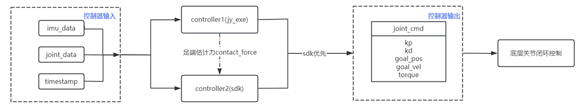
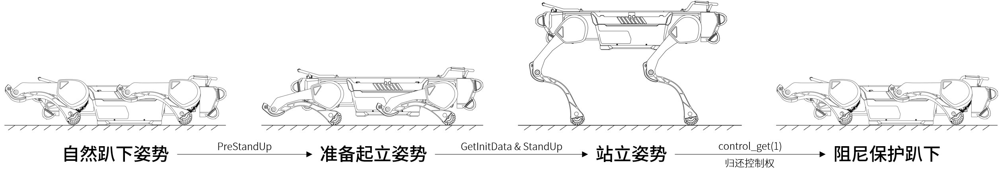

# 绝影X30运动控制SDK

[English](./README.md)

&nbsp;
## 1 SDK更新记录

### V1.0（2024-01-20） 
**[新增]** 首次发布。 

### V2.0（2024-03-29）
**[新增]** python版本。

&nbsp;
##  2 SDK简介
**MotionSDK** 是用于开发运动控制算法的SDK，支持C++和Python，提供了低速端（即**关节端**）的5个控制参数接口： $pos_{goal}$， $vel_{goal}$， $kp$， $kd$， $t_{ff}$。

当SDK有指令下发时，底层控制器会优先执行SDK的控制指令，将指令分发给机器狗的12个关节。底层关节根据5个控制参数可计算出最终关节目标力为：
$$T=kp*(pos_{goal} - pos_{real})+kd*(vel_{goal} - vel_{real})+t_{ff}$$

驱动器端会将最终的关节目标力转化成期望电流，并以20kHz的频率进行闭环控制。

当SDK没有指令下发超过1s时，底层控制器会拿回控制权，进入阻尼保护模式一段时间后，清空关节指令。

**控制流程可以参考下图：**



**控制参数使用举例：**

当做纯位控即位置控制时，电机的输出轴将会稳定在一个固定的位置。例如，如果我们希望电机输出端固定在3.14弧度的位置，下发数据格式示例：
$$pos_{goal}=3.14, vel_{goal}=0, kp=30, kd=0, t_{ff} = 0$$
当做速度控制时，下发数据格式示例：
$$pos_{goal}=0, vel_{goal}=5, kp=0, kd=1, t_{ff} = 0$$
当做阻尼控制时，下发数据格式示例：
$$pos_{goal}=0, vel_{goal}=0, kp=0, kd=1, t_{ff} = 0$$
当做力矩控制时，下发数据格式示例：
$$pos_{goal}=0, vel_{goal}=0, kp=0, kd=0, t_{ff} = 3$$
当做零力矩控制时，下发数据格式示例：
$$pos_{goal}=0, vel_{goal}=0, kp=0, kd=0, t_{ff} = 0$$
当做混合控制时，下发数据格式示例：
$$pos_{goal}=3.14, vel_{goal}=0, kp=30, kd=1, t_{ff} = 1$$

&nbsp;
## 3 硬件参数

### 3.1 身体与关节坐标系


> 注意：弧形箭头指示与其颜色一致的关节坐标系的旋转正方向。

### 3.2 身体连杆参数


| 参数                 | 数值     | 说明                 |
| -------------------- | -------- | -------------------- |
| 长度(Lbody)          | 0.98m    | 身体总长度           |
| 髋前后间距(Lhip)     | 0.582m   | 前后髋关节中心距离   |
| 髋左右间距(Whip)     | 0.16m    | 左右髋关节中心的距离 |
| 腿平面左右间距(Wleg) | 0.3935m | 腿平面左右的距离     |
| 宽度(Wbody)          | 0.454m    | 身体总宽度           |

### 3.3 腿部连杆参数


| 参数                       | 数值     | 说明                           |
| -------------------------- | -------- | ------------------------------ |
| 腿平面与髋侧摆关节距离(L1) | 0.1167m | 髋侧摆关节与腿平面距离         |
| 大腿长度(L2)               | 0.3m     | 髋前摆关节中心与膝关节中心距离 |
| 小腿长度(L3)               | 0.31m    | 膝关节中心与足底圆心距离       |
| 足底半径                   | 0.039m    | 足底缓冲件半径                 |

### 3.4 关节参数

| **关节**     | **运动范围** | **额定转矩** | **额定转速** | **峰值转矩** |
| ------------ | ------------ | ------------ | ------------ | ------------ |
| 髋侧摆(HipX) | -18.5°~33.5° | 28Nm         | 12rad/s      | 84Nm         |
| 髋前摆(HipY) | -170°~15°    | 28Nm         | 12rad/s      | 84Nm         |
| 膝关节(Knee) | 24°~140°     | 65Nm         | 11rad/s      | 180Nm        |

> 注意：绝影X30四足机器人的其他动力学参数可以在提供的URDF文件中获得。

&nbsp;
## 4 SDK包下载

使用git工具将 **x30_motion_sdk** 代码仓库克隆到本地:
```bash
cd xxxxxxxxxx    #cd <to where you want to store this project>
git clone --recurse-submodules https://github.com/DeepRoboticsLab/x30_motion_sdk.git
```
&nbsp; 
## 5 配置SDK参数和数据上报地址

开发者可通过ssh远程连接到运动主机，以配置运动主机上报关节等运动数据的目标地址和sdk相关参数。

SDK接收运动主机上报的数据的端口号默认为`43897`，C++版本的端口号可以在 ***/include/parse_cmd.h*** 中修改，Python版本的端口号可以在 ***/python/motion_sdk_example.py*** 中修改。

- 首先将开发主机连接到机器狗WiFi。

- 在开发主机上打开ssh连接软件，输入`ssh ysc@192.168.1.103`，密码为 `'` [英文单引号]，即可远程连接运动主机。

- 输入以下命令以打开网络配置文件：
	```Bash
	cd ~/jy_exe/conf/
	vim network.toml
	```

- 配置文件 ***network.toml*** 中，`ip`与`target_port`为一组IP地址和端口号，`ips`中的地址和`ports`中的端口号按顺序分别对应，配置文件具体内容如下：
	```toml
	ip = '192.168.1.103'
	target_port = 43897
	local_port = 43893
	ips = ["192.168.1.105","192.168.1.106","192.168.1.xxx"]
	ports = [43897,43897,43897]
	```
	
- 运动程序运行时，会向配置文件中的`ip`和`ips`所包含的地址以及其对应的端口号上报运动状态数据。

	- 如果 **MotionSDK** 在机器狗运动主机内运行，请确保配置文件中`ip`或`ips`已包含运动主机IP `192.168.1.103`，以及对应的端口号与程序接收数据的端口号一致；

	- 如果 **MotionSDK** 在开发者自己的开发主机中运行，请在`ips`中添加开发主机的静态IP `192.168.1.xxx`，并在`ports`中对应的位置添加上程序接受数据的端口号。

- 数据上报地址配置完成后，需要将运动主机向sdk上报数据的开关打开，首先打开配置文件 ***sdk_config.toml*** （如果没有的话，请先新建该文件）:
	```Bash
	cd ~/jy_exe/conf/
	vim sdk_config.toml
	```

- 修改配置文件 ***sdk_config.toml*** 中`enable_joint_data`的值：
	```toml
	enable_joint_data = true
	```

- 在同一个配置文件 ***sdk_config.toml*** 中，可按需对关节力矩限幅进行修改：
	```toml
	torque_limit=[42.0,42.0,90.0]
	```
	数组元素定义如下：

	| 数组元素 | 含义     | 取值范围  |数据类型|
	| --- | -------- | ---------- | ---------- |
	| torque_limit[0] | 对髋关节hipx的力矩限幅(N·m)| (0,84.0] | double |
	| torque_limit[1] | 对侧摆关节hipy的力矩限幅(N·m)| (0,84.0] | double |
	| torque_limit[2] | 对膝关节knee的力矩限幅(N·m)| (0,160.0] | double |

	> 注意：在刚开始测试一个新的运动程序的时候应将力矩限幅设置得较小一些，待程序验证无误后再放开力矩限幅，确保机器狗处于安全状态。

- 重启运动程序使配置生效：
	```bash
	cd ~/jy_exe
	sudo ./stop.sh
	sudo ./restart.sh
	```

&nbsp;
## 6 编译开发

C++版例程 ***/example/main.cpp*** 和Python版例程 ***/python/motion_example.py*** 提供了机器狗站立的简单demo，并在完成站立一段时间后将控制权归还给底层控制器，进入阻尼保护模式：



**但为了确保SDK的安全使用，在两个例程的原始代码中，下发指令到机器狗的代码是被注释掉的：**  

C++版例程( */example/main.cpp* )：
```c++
// if(is_message_updated_){
//   send2robot_cmd->set_send(robot_joint_cmd);  
// }               
```
Python版例程( */python/motion_sdk_example.py* ):
```python
# sender.set_send(robot_joint_cmd)
```
**注意：在取消注释前，开发者务必确保SDK与机器狗正常通讯（可参考“6.1 检查通讯”），并确保自己的下发控制指令正确，否则机器狗执行控制指令时可能会产生危险！**

**注意：用户在使用绝影X30执行算法和实验的过程中，请与机器狗保持至少5米距离，并将机器狗悬挂在调试架上避免意外造成人员和设备损伤。若实验过程中，机器狗摔倒或者用户想搬动机器狗位置，需要靠近机器狗时，用户应当使得机器狗处于急停状态或者使用 `sudo ./stop.sh` 命令关闭运动程序。**

### 6.1 检查通讯

MotionSDK采用UDP与机器狗进行通讯。

针对数据上报，可以在SDK里打印关节数据或陀螺仪数据等信息，以此判断是否收到机器狗上报的SDK数据；或者观察SDK运行时，是否打印“No data from the robot was received!!!!!!”，以此判断是否收到机器狗上报的SDK数据。

请参考6.3节对原始代码进行编译和运行，并观察程序运行过程中终端打印机器狗上报数据是否正常。

### 6.2 通讯问题排查

如果SDK未接收到机器狗上报的数据，可按照下述步骤进行排查：

- 首先检查开发主机是否与机器狗主机处于同一网段下（如果是在机器狗上运行SDK，此步骤可跳过）：将开发主机连到接机器狗的WiFi网络或尾部网口，然后在开发主机上ping运动主机，ping通之后ssh连接到机器狗运动主机内，在运动主机内ping开发主机的静态IP。如果无法ping通，请尝试手动设置自己开发主机的IP地址，并再次按照第5节对配置文件进行修改。

- 如果开发者的开发环境为虚拟机，建议把虚拟机网络连接方式改为桥接并手动设置虚拟机IP地址后重启虚拟机，并再次按照第5节对配置文件进行修改。

如果仍收不到机器狗上报数据，可在机器狗运动主机上抓包：

- 如果 **MotionSDK** 在机器狗运动主机内运行，运行`sudo tcpdump -x port 43897 -i lo`;

- 如果 **MotionSDK** 在开发者的开发主机内运行，运行`sudo tcpdump -x port 43897 -i eth1`。

执行抓包命令后等待2分钟，观察机器狗是否有原始数据上报。如果没有，输入top命令查看机器狗本体控制程序进程jy_exe是否正常运行，若jy_exe没有正常运行，参照以下指令重启运动程序：

```bash
 cd ~/jy_exe
 sudo ./stop.sh
 sudo ./restart.sh
```

### 6.3 编译开发
确保SDK与机器狗正常通讯，并确保自己的下发控制指令正确后，可以将原始代码中下发指令到机器狗的代码取消注释，然后重新编译运行。

#### 6.3.1 C++版本编译运行

打开一个新的终端，新建一个空的 ***build*** 文件夹（如果已经创建过 ***build*** 文件夹，可直接清空文件夹中所有内容）；
```bash
cd xxxxxxxx     # cd <path to where you want to create build directory>
mkdir build
```

打开 ***build*** 文件夹并编译：
```bash
cd build
cmake .. -DBUILD_EXAMPLE=ON
make -j
```

编译结束后，会在 ***/build/example*** 目录下生成一个名为 ***motion_sdk_example*** 的可执行文件，运行该文件时，机器狗将会执行下发的控制指令：
```bash
./example/motion_sdk_example
```

#### 6.3.2 Python版本编译运行

Python版本程序采用pybind的形式生成。

若已编译过C++版本的代码，可直接进入之前创建的 ***build*** 文件夹；若是首次编译，需新建一个 ***build*** 文件夹：
```bash
cd xxxxxxxx     # cd <path to where you want to create build directory>
mkdir build
```

打开 ***build*** 文件夹并编译；
```bash
cd build
cmake .. -DBUILD_PYTHON=ON
make -j
```

正常情况下编译好的动态库文件会自动复制到 ***/python/lib*** 目录下，随后可以进入 ***/x30_motion_sdk/python*** 目录直接执行 ***motion_sdk_example.py*** 文件：
```bash
cd python/
python motion_sdk_example.py
```
&nbsp;

## 7 示例代码(C++)

本节对 ***/example/main.cpp*** 进行说明。  

定时器，用于设置算法周期，获得当前时间：

```cpp
TimeTool my_set_timer;
my_set_timer.time_init(int);                              		  ///< Timer initialization, input: cycle; unit: ms
my_set_timer.get_start_time();                           		  ///< Obtain time for algorithm
my_set_timer.time_interrupt()			      		              ///< Timer interrupt flag
my_set_timer.get_now_time(double);               		          ///< Get the current time
```

SDK在绑定机器狗的IP和端口后，获取控制权，发送关节控制指令：

```cpp
SendToRobot* send2robot_cmd = new SendToRobot("192.168.1.103",43893);   ///< Create a sender thread
send2robot_cmd->robot_state_init();                           		    ///< Reset all joints to zero and gain control right
send2robot_cmd->set_send(RobotCmdSDK); 			     		            ///< Send joint control command
send2robot_cmd->control_get(int);                            		    ///< Return the control right
```

SDK接收机器狗下发的关节数据：

```cpp
ParseCommand* robot_data_rec = new ParseCommand;           		  ///< Create a thread for receiving and parsing
robot_data_rec->getRecvState(); 			      		          ///< Receive data from 12 joints
```

SDK接收到的关节数据将保存在`robot_data`中：

```cpp
RobotDataSDK *robot_data = &robot_data_rec->getRecvState(); 		  ///< Saving joint data to the robot_data
///< Left front leg：fl_leg[3], the sequence is fl_hipx, fl_Hipy, fl_knee
///< Right front leg：fr_leg[3], the sequence is fr_hipx, fr_Hipy, fr_knee
///< Left hind leg：hl_leg[3], the sequence is hl_hipx, hl_Hipy, hl_knee
///< Right hind leg：hr_leg[3], the sequence is hr_hipx, hr_Hipy, hr_knee
///< All joints：leg_force[12]/joint_data[12], the sequence is fl_hipx, fl_hipy, fl_knee, fr_hipx, fr_Hipy, fr_knee, hl_hipx, hl_hipy, hl_knee, hr_hipx, hr_hipy, hr_knee
	
robot_data->fl_force[]				  ///< Contact force on left front foot in X-axis, Y-axis and Z-axis
robot_data->fr_force[]				  ///< Contact force on right front foot in X-axis, Y-axis and Z-axis
robot_data->hl_force[]				  ///< Contact force on left hind foot in X-axis, Y-axis and Z-axis
robot_data->hr_force[]				  ///< Contact force on right hind foot in X-axis, Y-axis and Z-axis
robot_data->contact_force[]			  ///< Contact force on all feet
	
robot_data->tick						  ///< Cycle of operation
	
robot_data->imu							      ///< IMU data	
robot_data->imu.acc_x						  ///< Acceleration on X-axis, unit m/s^2
robot_data->imu.acc_y						  ///< Acceleration on Y-axis, unit m/s^2
robot_data->imu.acc_z						  ///< Acceleration on Z-axis, unit m/s^2
robot_data->imu.roll					      ///< Roll angle, unit deg
robot_data->imu.pitch					      ///< Pitch angle, unit deg
robot_data->imu.yaw					          ///< Yaw angle, unit deg
robot_data->imu.omega_x			  	          ///< angular velocity on X-axis, unit rad/s
robot_data->imu.omega_y			  	          ///< angular velocity on Y-axis, unit rad/s
robot_data->imu.omega_z		   	 	          ///< angular velocity on Z-axis, unit rad/s
robot_data->imu.buffer_byte					  ///< Buffer data
robot_data->imu.buffer_float			      ///< Buffer data
robot_data->imu.timestamp					  ///< Time when the data is obtained

robot_data->joint_state						  ///< Motor status
robot_data->joint_state.fl_leg[].position	  ///< Motor position of left front leg
robot_data->joint_state.fl_leg[].temperature  ///< Motor temperature of left front leg
robot_data->joint_state.fl_leg[].torque		  ///< Motor torque of left front leg 
robot_data->joint_state.fl_leg[].velocity	  ///< Motor velocity of left front leg
robot_data->joint_state.joint_data            ///< All joint data
```

机器狗关节控制指令：

```cpp
RobotCmdSDK robot_joint_cmd;  					  ///< Target data of each joint
///< Left front leg：fl_leg[3], the sequence is fl_hipx, fl_Hipy, fl_knee
///< Right front leg：fr_leg[3], the sequence is fr_hipx, fr_Hipy, fr_knee
///< Left hind leg：hl_leg[3], the sequence is hl_hipx, hl_Hipy, hl_knee
///< Right hind leg：hr_leg[3], the sequence is hr_hipx, hr_Hipy, hr_knee
///< All joints：leg_force[12]/joint_data[12], the sequence is fl_hipx, fl_hipy, fl_knee, fr_hipx, fr_Hipy, fr_knee, hl_hipx, hl_hipy, hl_knee, hr_hipx, hr_hipy, hr_knee

robot_joint_cmd.fl_leg[]->kd;					  ///< Kd of left front leg
robot_joint_cmd.fl_leg[]->kp;					  ///< Kp of left front leg
robot_joint_cmd.fl_leg[]->position;				  ///< Position of left front leg
robot_joint_cmd.fl_leg[]->torque;				  ///< Torue of left front leg
robot_joint_cmd.fl_leg[]->velocity;				  ///< Velocity of left front leg
```

机器狗站立的简单demo：  
1.PreStanUp：调整姿势，将机器狗的腿收起来，为站立做准备；  
2.GetInitData：记录下当前时间与关节数据；  
3.StandUp：机器狗起立。

```cpp
MotionSDKExample robot_set_up_demo;                      		  ///< Demo for testing

/// @brief Spend 1 sec drawing the robot's legs in and preparing to stand
/// @param cmd Send control command
/// @param time Current timestamp
/// @param data_state Real-time status data of robot
robot_set_up_demo.PreStandUp(robot_joint_cmd,now_time,*robot_data);	

/// @brief Only the current time and angle are recorded
/// @param data Current joint data
/// @param time Current timestamp
robot_set_up_demo.GetInitData(robot_data->motor_state,now_time);	

/// @brief Spend 1.5 secs standing up
/// @param cmd Send control command
/// @param time Current timestamp
/// @param data_state Real-time status data of robot
robot_set_up_demo.StandUp(robot_joint_cmd,now_time,*robot_data);
```
&nbsp;
### 其他注意事项
1. X30运动主机是ARM架构的，如果开发者想在运动主机上编译自己的程序，需要注意。
2. WiFi通讯受网络环境干扰产生的通讯延迟波动，可能对控制频率在500Hz以上的控制器有一定影响。
